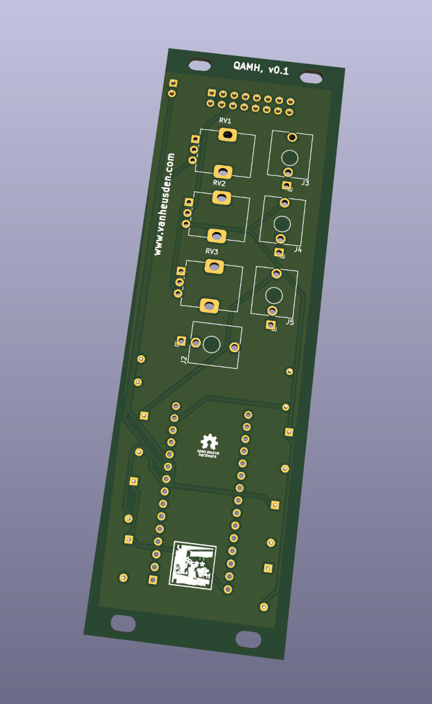
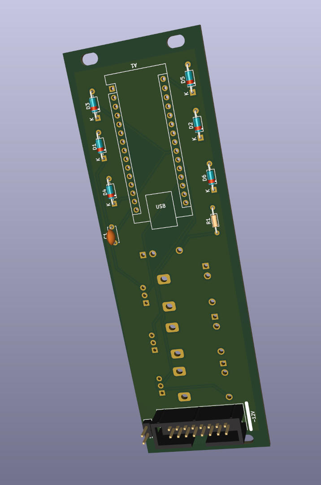

qamh
----

Due to the unavailability for a long time already of the Grains module, I decided to recreate the device.
This repo contains the Kicad schematics and PCB design.

This device is an Eurorack/Doepfer-A100 modulair-synthesizer module. It allows you to upload your own firmware and then produce whatever effect you want it to do.

I found a modification on the web where someone put a piezo on pin 6 of the Arduino (Nano), for that I added a header (GND + D6).

I did *not* look at the original PCB, only at the documentation I found on the web ( https://www.thonk.co.uk/shop/ginkosynthese-grains-full-diy-kit/ ).

The design should be compatible with the original Grains module and should be able to run the original software without modifications.

This design is released under the CC0 license, but do with it whatever you want.

Clone this repo using "--recurse-submodules" as it contains submodules.

Please note: this is work in progress. At the point of writing this (October 7, 2023) the design was not tested.

Folkert van Heusden <mail@vanheusden.com>
